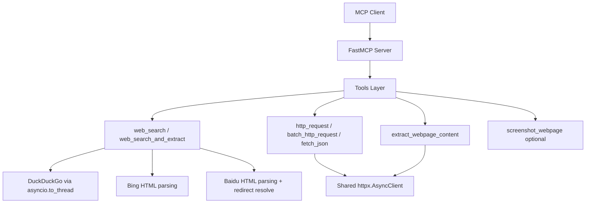

# MCP Web Server

本项目是一个本地 MCP Server，提供免费网络访问能力，可接入 Claude Desktop / Claude Code 等 MCP 客户端。

## 功能概览

- `http_request`: 通用 HTTP 请求
- `web_search`: 可配置搜索引擎（DuckDuckGo / Bing / 百度）
- `extract_webpage_content`: 网页正文提取（含标题、列表、表格、代码块、引用）
- `fetch_json`: 获取并解析 JSON
- `web_search_and_extract`: 搜索 + 并发提取一体化
- `batch_http_request`: 批量并发请求
- `screenshot_webpage`（可选）: 网页截图并返回 Base64（需安装 Playwright）

## 安装

```bash
uv pip install -e .
```

开发依赖：

```bash
uv pip install -e ".[dev]"
```

## 启动服务

```bash
uv run python run_server.py
```

## MCP 配置

### Claude Code

```bash
claude mcp add web-server -s local -- uv run --directory /path/to/your/project python run_server.py
```

### Claude Desktop

请参考仓库中的示例配置文件：`claude_desktop_config.example.json`。

> 使用前将 `--directory` 路径改为你的本地项目路径。

## 运行测试

```bash
uv pip install -e ".[dev]"
pytest
```

## 环境变量

| 变量名 | 说明 | 默认值 |
|---|---|---|
| `MCP_LOG_LEVEL` | 日志级别 | `INFO` |
| `MCP_HTTP_PROXY` | HTTP 代理 | 空 |
| `MCP_HTTPS_PROXY` | HTTPS 代理 | 空 |
| `MCP_USER_AGENT` | 自定义 User-Agent | 内置 UA |
| `MCP_DEFAULT_TIMEOUT` | 默认请求超时（秒） | `30` |
| `MCP_SEARCH_ENGINE` | 搜索引擎：`duckduckgo`/`bing`/`baidu` | `duckduckgo` |
| `MCP_BING_DOMAIN` | Bing 检索域名（可设 `www.bing.com`/`cn.bing.com`） | `www.bing.com` |
| `MCP_SEARCH_API_KEY` | 可选搜索 API Key（预留扩展） | 空 |
| `MCP_SEARCH_API_ENDPOINT` | 可选搜索 API Endpoint（预留扩展） | 空 |
| `MCP_RATE_LIMIT_SEARCH` | `web_search` 每分钟调用上限 | `5` |
| `MCP_RATE_LIMIT_HTTP` | `http_request` 每分钟调用上限 | `30` |
| `MCP_RATE_LIMIT_EXTRACT` | `extract_webpage_content` 每分钟调用上限 | `10` |
| `MCP_STDIN_INVALID_INPUT_POLICY` | 非法 stdin 行处理策略：`ignore`/`warn`/`strict` | `warn` |

`MCP_STDIN_INVALID_INPUT_POLICY` 说明：

- `warn`（默认）：忽略非法 JSON-RPC 行并记录 warning
- `ignore`：忽略非法 JSON-RPC 行且不记录 warning
- `strict`：收到非法 JSON-RPC 行即快速失败（便于定位客户端写入问题）

`MCP_SEARCH_ENGINE` 说明：

- `duckduckgo`：默认选项，无 API Key；在部分网络环境下可能不可用。
- `bing`：默认使用 `www.bing.com` 页面检索；可通过 `MCP_BING_DOMAIN=cn.bing.com` 切换大陆入口。
- `baidu`：使用百度网页检索；中国大陆可用性通常较好。

可选 API Key 模式说明：

- 当前版本默认使用“网页检索”模式（无需 API Key）。
- `MCP_SEARCH_API_KEY` / `MCP_SEARCH_API_ENDPOINT` 已预留，便于后续接入官方 API 或第三方聚合 API。

## 可选截图依赖

```bash
uv pip install -e ".[screenshot]"
playwright install chromium
```

## 可选 Web 配置界面

项目内提供了一个基于 Flask 的辅助配置界面（`web_config.py` / `run_web_config.py`），用于通过浏览器引导执行 `claude mcp add`：

```bash
uv pip install -e ".[web]"
uv run python run_web_config.py
```

打开 [http://localhost:5000](http://localhost:5000) 即可使用。  
如果你只通过命令行配置 MCP，可忽略这两个文件。

## 架构图



## 版本记录

详见 `CHANGELOG.md`。
